# IELTS Speaking/Writing Studio

一个面向 IELTS 备考的 Speaking / Writing 练习工作台。主线已经演进为一个以 Django + 单页前端为核心、叠加 AI Provider、WASM 音频预处理和实时语音扩展的练习产品。


## Public Preview

- Current public URL: https://ranch-lover-russell-hammer.trycloudflare.com
- Local service URL: http://127.0.0.1:8767/
- Note: this uses a Cloudflare quick tunnel, so the URL may change if the tunnel process restarts.


## Product Screens

### Speaking Practice

| P1 short-answer practice | P2 cue-card practice |
| --- | --- |
| 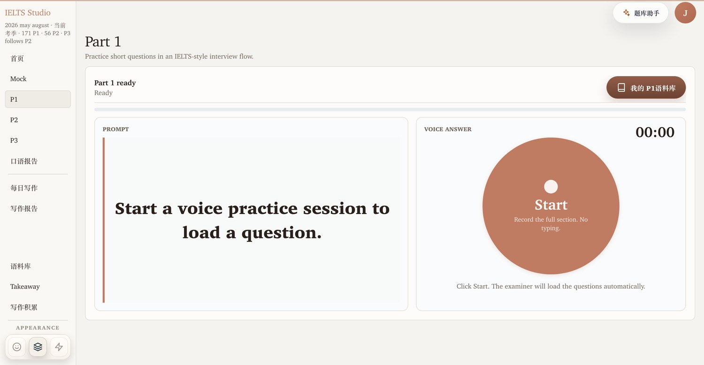 | 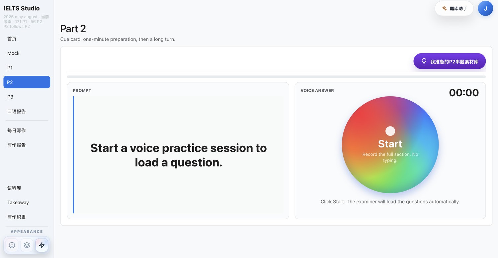 |

| AI follow-up in practice | Speaking report and coaching |
| --- | --- |
| 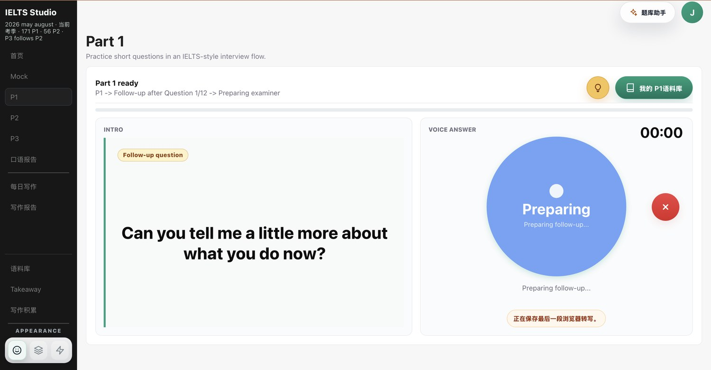 | 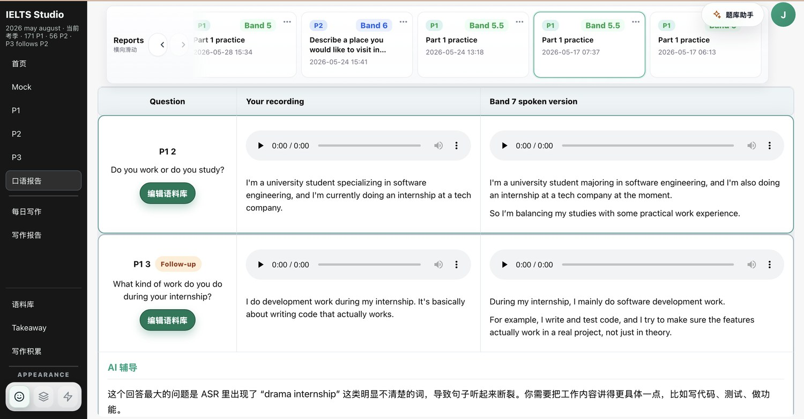 |

| Speaking report overview | P1 corpus editor |
| --- | --- |
| 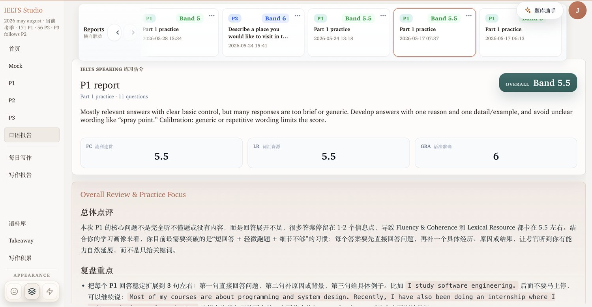 | 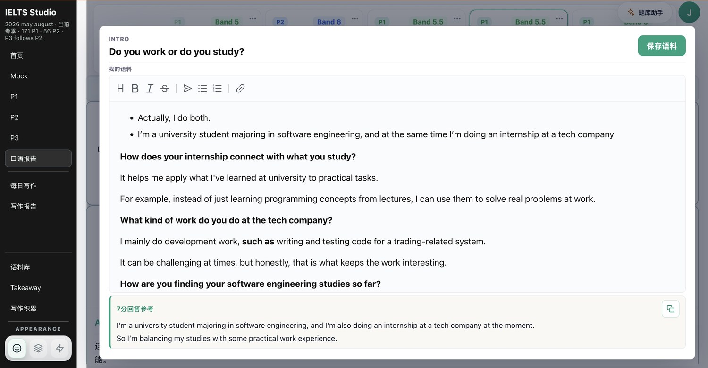 |

### Writing Studio

| Daily writing workspace | Paragraph-level writing report |
| --- | --- |
| 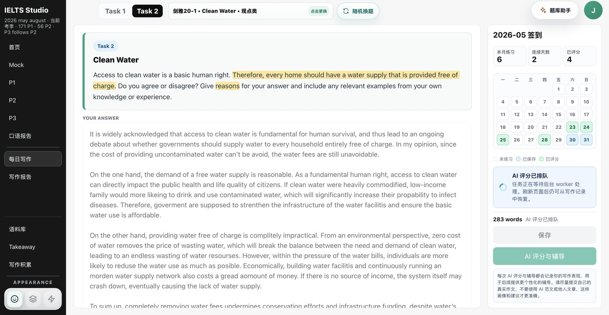 | 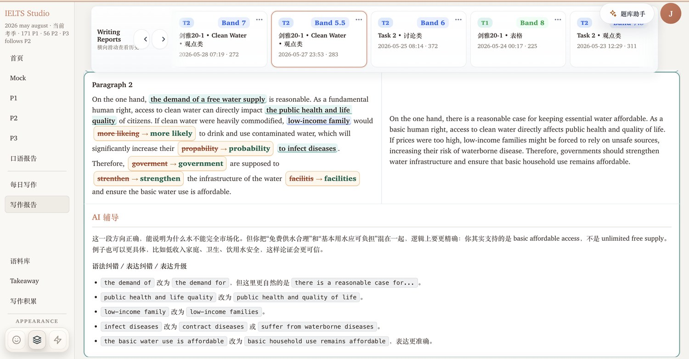 |

### Corpus and Takeaway

| Corpus workspace | P1 question library |
| --- | --- |
| 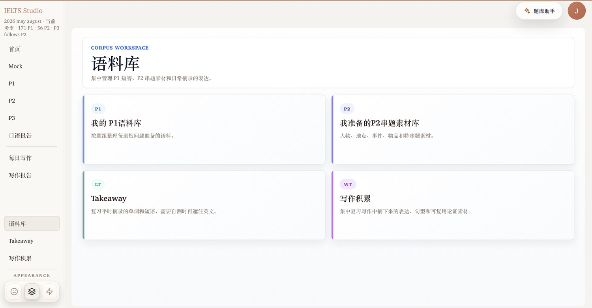 | 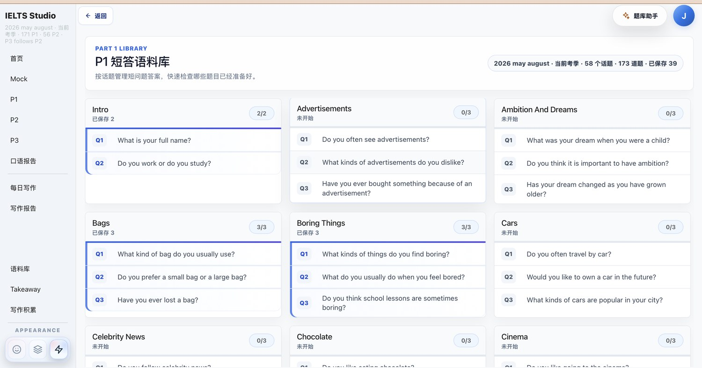 |

| P2 material library | Takeaway review |
| --- | --- |
| 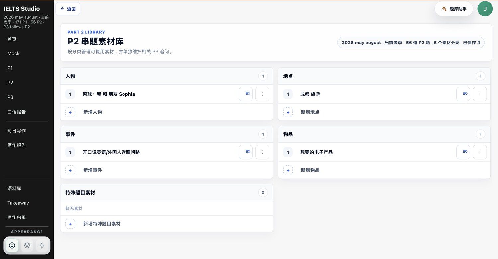 | 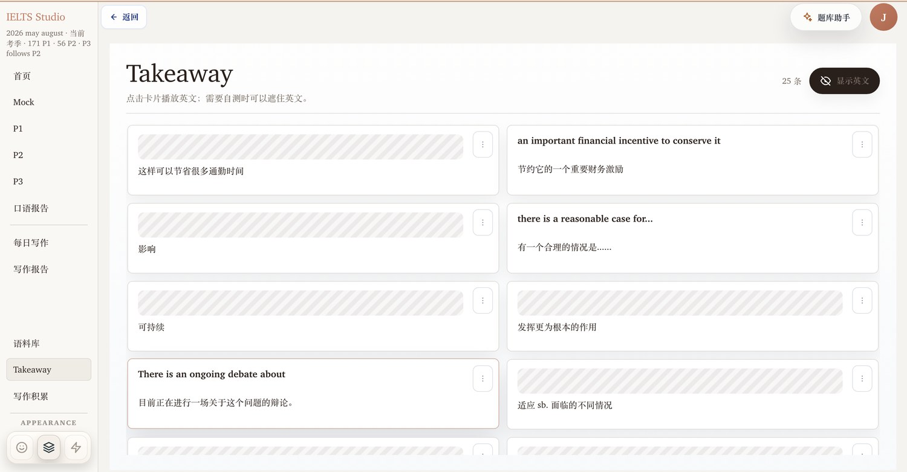 |

## System Overview

- `backend_django/`：Django 5.2 后端，负责账号、口语练习、写作题库、报告、AI task、计费、TTS/ASR 接口和静态资源托管。
- `web/static/`：无构建步骤的单页前端，Django 直接提供首页、JS/CSS、vendor、WASM 资源和 `/api/*`。
- `include/` + `src/`：保留并扩展的 C++ 面试/IELTS CLI、音频核心、realtime client 和软件构造实验代码。
- `软件构造/`：课程实验交付材料，围绕现有产品做设计模式、TDD、重构、开源复用与 WASM 实验。

> 旧的 `web/ielts_server.py` 已退役并冻结为历史参考。正常开发、演示和部署请使用 Django；只有显式设置 `IELTS_ALLOW_LEGACY_SERVER=1` 时才可短暂启动旧服务做对照调试。

## 项目亮点

- **完整口语练习链路**：IELTS Speaking P1 / P2 / P3 / Mock，支持题库抽样、录音上传、转写、追问、评分、报告历史和考官音频播放。
- **写作工作台**：每日写作、Task 1 Academic / Task 2 题库、报告列表、段落级反馈、拼写/语法/表达纠错和写作积累。
- **AI Provider 可切换**：后端已有 `AIProvider` 边界，支持 OpenAI-compatible HTTP 端点（如 Aiapis 等兼容服务）以及本地 `codex exec` fallback。
- **低延迟追问通道**：P1/P3 追问可走 HTTP streaming / SSE；HTTP 失败时回落 Codex CLI，再失败时明确标记 fallback。
- **浏览器音频增强**：C++ `audio_core` 抽成纯核，可通过 Emscripten 编译到 WASM；`libfvad` 提供 WebRTC VAD；前端使用 howler.js 稳定播放考官 TTS。
- **Realtime ASR 扩展链路**：Django ASGI + Channels 提供 WebSocket PCM 上行，`VolcEngine ASR` 配置后可接实时转写；失败时不影响传统“录完上传”的主流程。
- **课程实验可验证**：软件构造实验 2-5 都有脚本化验证入口，实验材料与真实产品重构线对应。

## 架构概览

```text
Browser SPA (web/static)
  |-- P1 / P2 / P3 / Mock speaking UI
  |-- Writing Studio / reports / corpus / Takeaway
  |-- MediaRecorder baseline recording
  |-- howler.js examiner audio playback
  |-- optional WASM audio preprocessor
  |-- optional WebSocket PCM uplink
          |
          v
Django backend (backend_django)
  |-- accounts / billing / common
  |-- speaking APIs, reports, corpus, TTS, ASR status
  |-- writing prompt bank, entries, scoring reports
  |-- AI task queue + provider adapters
  |-- ASGI WebSocket consumers for realtime PCM
          |
          +--> OpenAI-compatible HTTP provider (AI_HTTP_*)
          +--> local Codex CLI fallback
          +--> VolcEngine TTS / ASR when configured
          +--> SQLite locally, MySQL-ready settings for production

C++ / WASM side line
  include/ielts/audio_core.h
  src/ielts/audio_core.cpp
  src/ielts/audio_core_wasm.cpp
  third_party/libfvad/
  web/static/wasm/
```

## 功能范围

### Speaking

- P1 短问答、P2 cue card、P3 discussion lab、完整 Mock。
- 题库来自 `data/ielts/part1/` 和 `data/ielts/part2/`，包含 2025/2026 题库数据。
- 候选人录音通过浏览器 `MediaRecorder` 采集并上传到 Django。
- 报告包含 IELTS 分数摘要、分项反馈、逐轮 transcript、Band 7 改写、AI coaching 和音频回放。
- 追问支持批处理与 streaming 两条路径；HTTP provider 不可用时保留 Codex CLI / deterministic fallback。
- P1/P2 语料库、P2 串题素材、P3 追问素材和 Language Takeaway 已接入 SPA。

### Writing

- 每日写作、题库选择、日历/报告列表。
- Cambridge/public/reported actual 数据分布在 `data/ielts/writing/`。
- 写作评分可通过 AI task 创建，worker 异步处理；刷新后可恢复任务状态。
- 报告展示总分、Task Achievement/Response、CC、LR、GRA、段落级讲评、model answer、inline annotations 和拼写/语法纠错。
- 写作积累与 Takeaway 分离，便于沉淀表达和论证素材。

### Audio / Realtime

- `audio_core` 提供 RMS、peak、VAD、静音裁剪、重采样等纯函数。
- `third_party/libfvad/` 复用 WebRTC VAD，编译进 native test 和 WASM 构建链路。
- `scripts/build_audio_core_wasm.sh` 使用 Emscripten 生成 `web/static/wasm/audio_core_wasm.js/.wasm`。
- `web/static/vendor/howler.min.js` 用于考官音频播放层，避免旧手写播放器的 readyState/事务竞态。
- `backend_django/config/asgi.py` + `apps/speaking/routing.py` 提供 `/ws/realtime/ping/` 和 `/ws/realtime/pcm/`。

## 目录结构

```text
.
├── backend_django/          # Django 后端、ASGI/WSGI、apps、management commands、tests
│   ├── apps/accounts/       # 用户与候选人资料
│   ├── apps/ai/             # AI task、provider routing、HTTP/Codex/fallback adapters
│   ├── apps/billing/        # 钱包、预留、结算、Codex usage events
│   ├── apps/speaking/       # 口语练习、报告、TTS、ASR、WebSocket consumers
│   └── apps/writing/        # 写作题库、entry、score、report、learner profile
├── web/static/              # Django 托管的 SPA 静态资源
│   ├── app.js               # 主交互逻辑
│   ├── index.html           # 单页 DOM 锚点
│   ├── styles.css           # 视觉系统
│   ├── vendor/howler.min.js # 本地 vendor，离线可演示
│   └── wasm/                # audio_core WASM demo / worklet / preprocessor
├── include/                 # C++ 头文件
├── src/                     # C++ 实现：CLI、IELTS session、services、audio_core
├── third_party/libfvad/     # vendored WebRTC VAD
├── data/ielts/              # 口语题库、写作题库、prompt
├── docs/                    # 迁移、AI pipeline、legacy retirement、实验规格
├── scripts/                 # 验证、导入、WASM 构建、Windows 启停脚本
├── tests/                   # C++/历史 Python 测试
├── requirements/            # Django local/prod 依赖
└── 软件构造/                # 课程实验报告、PPT、PlantUML、验证索引
```

## 快速启动

推荐使用 Python 虚拟环境。以下命令均在项目根目录执行。

```bash
python3 -m venv .venv-django
. .venv-django/bin/activate
pip install -r requirements/local.txt

python backend_django/manage.py migrate
scripts/start-local-stack.sh
```

打开：

```text
http://127.0.0.1:8767
```

`scripts/start-local-stack.sh` 会同时启动 Django 和 `run_ai_worker`。如果本机存在
`~/.cc-switch/cc-switch.db`，脚本会自动读取 Codex 的 Aiaps1/Aiapis provider，
把 OpenAI-compatible HTTP provider 注入 worker，默认模型为 `gpt-5.4-mini`。
脚本不会把 API key 打印到终端或日志。

如需手工覆盖 provider，可以在启动前显式导出：

```bash
export AI_HTTP_BASE_URL="https://<compatible-host>/v1"
export AI_HTTP_API_KEY="<api-key>"
export AI_HTTP_MODEL="gpt-5.4-mini"
export AI_HTTP_TIMEOUT_SECONDS="60"
export SPEAKING_AI_CALL_MODE="chain"
export SPEAKING_AI_MODEL="gpt-5.4-mini"
scripts/start-local-stack.sh
```

如果只启动 `runserver` 而没有启动 worker，写作页会一直停在“AI 评分已排队”。
如果 worker 没有带 `AI_HTTP_*`，它会回到较慢的本地 Codex CLI / fallback 路径。

需要临时公网展示时：

```bash
IELTS_PUBLIC=1 scripts/start-local-stack.sh
```

公网 quick tunnel URL 会出现在 `.runlogs/cloudflared.err.log`，本地地址仍是
`http://127.0.0.1:8767`。

健康检查：

```bash
curl http://127.0.0.1:8767/api/health/
```

## 环境变量

不要把真实 key、账号密码、私有 URL 写进仓库。下面只展示占位符。

### Django / Database

```bash
export DJANGO_SECRET_KEY="<replace-me>"
export DJANGO_DEBUG="1"
export DJANGO_ALLOWED_HOSTS="127.0.0.1,localhost"
export DJANGO_CSRF_TRUSTED_ORIGINS="https://<your-domain>"

# 本地默认 SQLite；生产可切 MySQL
export DJANGO_DB_ENGINE="django.db.backends.mysql"
export DJANGO_DB_NAME="<db-name>"
export DJANGO_DB_USER="<db-user>"
export DJANGO_DB_PASSWORD="<db-password>"
export DJANGO_DB_HOST="<db-host>"
export DJANGO_DB_PORT="3306"
```

### AI Provider

```bash
export AI_PROVIDER_MODE="local_safe"
export AI_DEFAULT_PROVIDER="codex"
export AI_PROVIDER_ENABLE_CODEX="1"
export AI_PROVIDER_ENABLE_OPENAI="1"

# OpenAI-compatible Chat Completions endpoint，例如 Aiapis 或其他兼容服务
export AI_HTTP_BASE_URL="https://<compatible-host>/v1"
export AI_HTTP_API_KEY="<api-key>"
export AI_HTTP_MODEL="<model-name>"
export AI_HTTP_TIMEOUT_SECONDS="8"

# 禁用 Codex fallback 时可用
export IELTS_WEB_DISABLE_CODEX="1"
```

### TTS / Realtime ASR

```bash
export VOLCENGINE_ASR_ENABLED="1"
export VOLCENGINE_ASR_WS_URL="wss://<asr-endpoint>"
export VOLCENGINE_ASR_APP_ID="<app-id>"
export VOLCENGINE_ASR_ACCESS_KEY="<access-key>"
export VOLCENGINE_ASR_APP_KEY="<app-key>"
export VOLCENGINE_ASR_RESOURCE_ID="<resource-id>"
export VOLCENGINE_ASR_TIMEOUT_SECONDS="30"
export VOLCENGINE_ASR_FFMPEG="ffmpeg"
```

未配置 ASR/TTS 时，主流程仍可用；系统会走浏览器/本地 fallback 或明确返回不可用状态。

## 常用开发命令

### Django 检查与测试

```bash
python backend_django/manage.py check
python backend_django/manage.py test
python scripts/validate_legacy_server_retirement.py
```

### 前端静态脚本粗查

```bash
node --check web/static/app.js
node --check web/static/realtime-pcm-uplink.js
node --check web/static/speaking-audio-preprocessor-runtime.js
```

### C++ / audio_core

```bash
cmake -S . -B build
cmake --build build --target IELTSSpeakingSimulator -j
cmake --build build --target audio_core_test -j
ctest --test-dir build -R audio_core_test --output-on-failure
```

### WASM 构建

需要先安装并激活 Emscripten：

```bash
scripts/build_audio_core_wasm.sh
```

生成目标位于 `web/static/wasm/audio_core_wasm.js` 和 `web/static/wasm/audio_core_wasm.wasm`。这些是构建产物，当前 `.gitignore` 明确忽略，不应作为源码提交。

### 软件构造实验验证

```bash
scripts/run_software_construction_deliverables_validation.sh

# 或单独验证
scripts/run_experiment2_design_validation.sh
scripts/run_experiment3_tdd_validation.sh
scripts/run_experiment4_refactor_validation.sh
scripts/run_experiment5_reuse_validation.sh
```

## 旧服务退役边界

生产/本地正常入口：

```bash
python backend_django/manage.py runserver 127.0.0.1:8767 --noreload
```

旧入口 `web/ielts_server.py` 已冻结，不能用于新功能、公开演示或生产流量。仅当需要历史行为对照时才可短暂执行：

```bash
IELTS_ALLOW_LEGACY_SERVER=1 python web/ielts_server.py --host 127.0.0.1 --port 8765
```

相关约束见 `docs/LEGACY_SERVER_RETIREMENT.md`。

## 软件构造实验产物

`软件构造/` 目录把真实产品演进包装为课程实验交付：

| 实验 | 主题 | 代表材料 |
| --- | --- | --- |
| 实验 1 | 原始课程报告 | `软件构造_实验1_报告.docx` |
| 实验 2 | 设计模式与类设计 | `重构总体架构.md`、`实验2_设计文档.md`、`实验2_类图.puml` |
| 实验 3 | TDD 验证 | `实验3_TDD验证报告.md`、`tests/audio_core_test.cpp` |
| 实验 4 | 重构坏味道 | `实验4_重构报告.md`、`include/ielts/audio_core.h`、`src/ielts/audio_core.cpp` |
| 实验 5 | 开源复用与 WASM | `实验5_开源复用与WASM方案.md`、`third_party/libfvad/`、`web/static/vendor/howler.min.js` |

实验叙事遵循同一条主线：保留 Django + SPA 的成熟产品主流程，在音频、AI provider、WASM、realtime gateway 上做增量重构和可验证改进。

## 当前状态与路线图

### 已落地

- Django 已接管静态前端和 `/api/*`。
- 口语 P1/P2/P3/Mock、报告历史、语料库、Takeaway 已在 SPA 中工作。
- 写作题库、写作 entry、写作报告、AI task worker 已接入。
- Codex CLI provider、OpenAI-compatible HTTP provider、fallback provider 边界已存在。
- howler.js、本地 vendor、stable examiner audio 播放链路已纳入前端。
- ASGI/Channels WebSocket realtime PCM 通道已作为扩展链路加入。
- 旧 `web/ielts_server.py` 已退役并有验证脚本保护。

### 后续方向

- 进一步收敛 `web/static/app.js`，按 `api-client`、`writing`、`speaking`、`shared-ui` 边界拆分。
- 完成 realtime ASR 在真实凭据下的端到端稳定性验证。
- 补齐生产 ASGI 部署说明与反向代理配置。
- 扩展 AI provider 配置页和 provider health diagnostics。
- 继续减少 C++ CLI 与 Web 主线之间的重复逻辑，把可复用音频能力沉到 `audio_core`。

## 安全说明

- API key 只读环境变量，不进入代码、README、测试 fixture、日志或报告。
- `web/static/` 里不能放任何后端凭据。
- 对外公开时请检查 `.runlogs/`、`media/`、`reports/`、本地数据库和临时文档是否包含个人数据。
- 本仓库的 demo fallback 是为了可演示性，不应被描述为真实 AI 成功结果。
