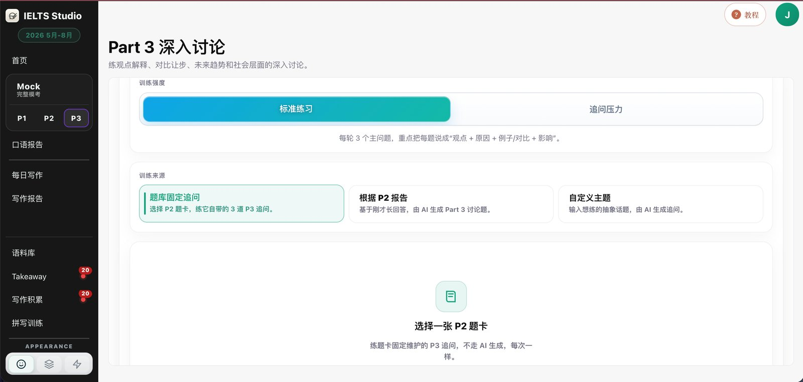
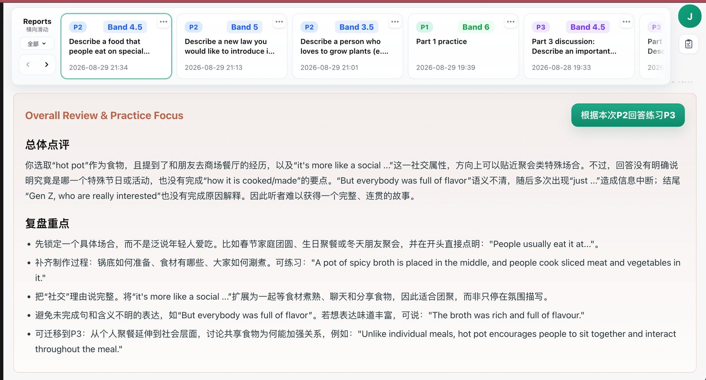
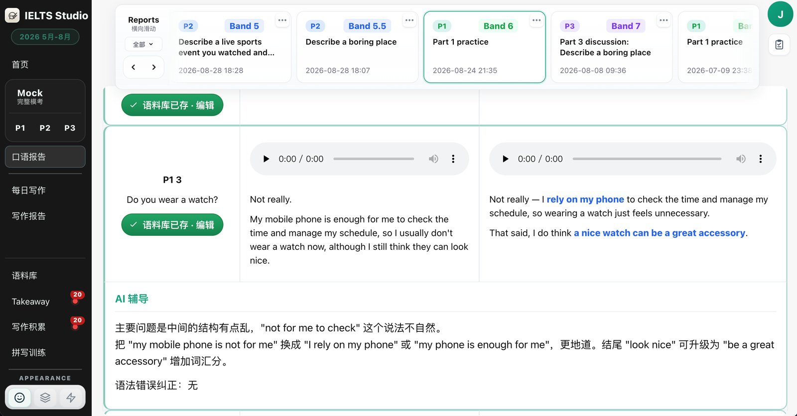
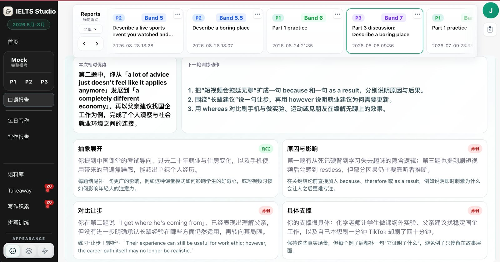
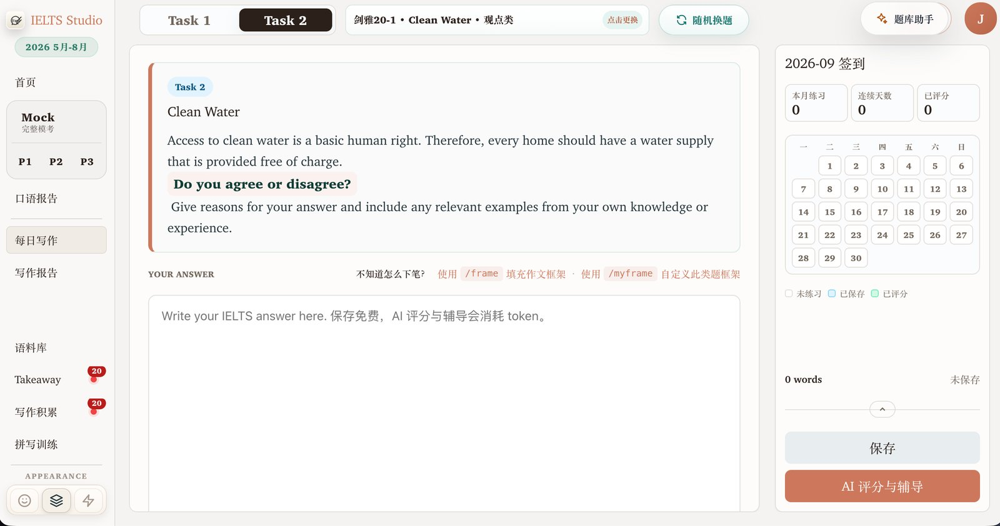
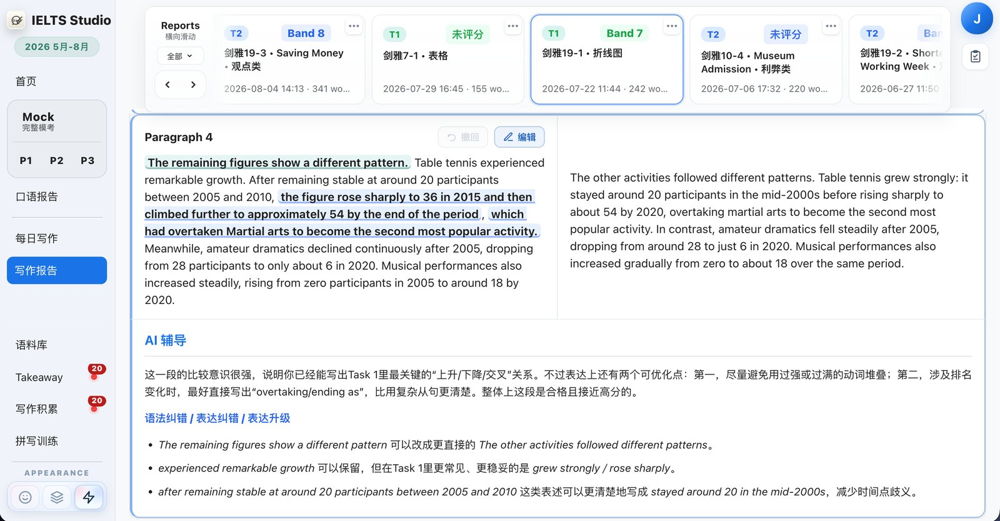
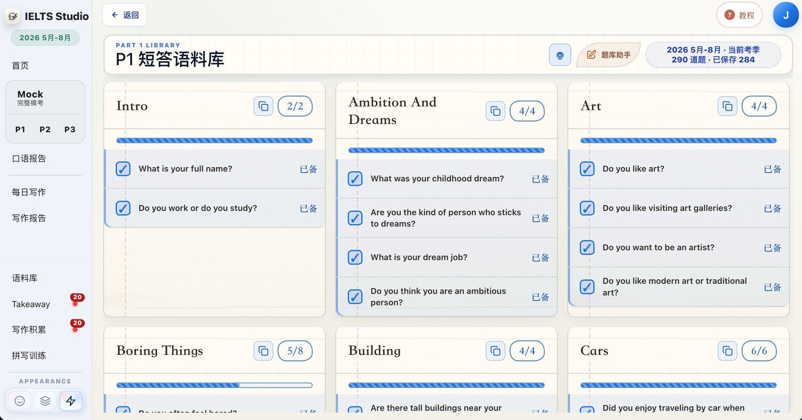
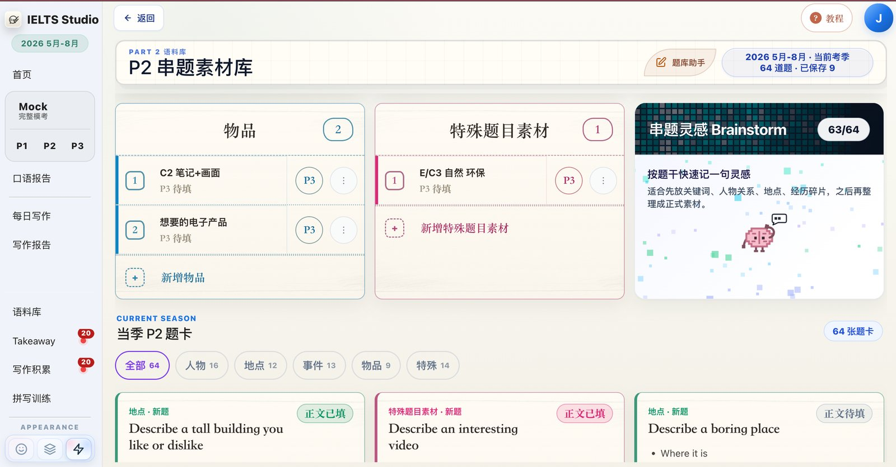
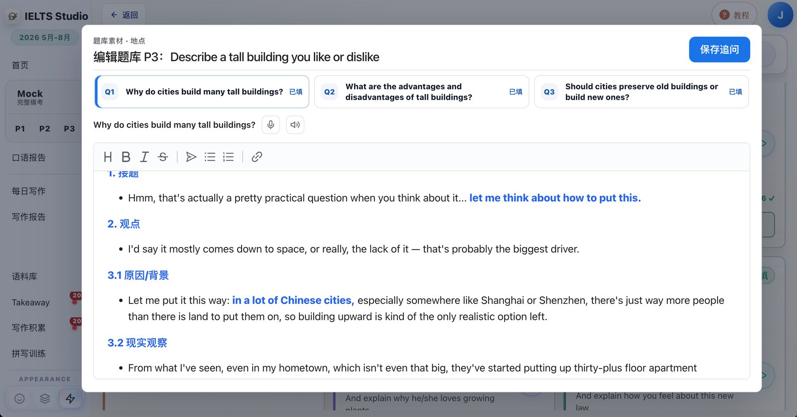
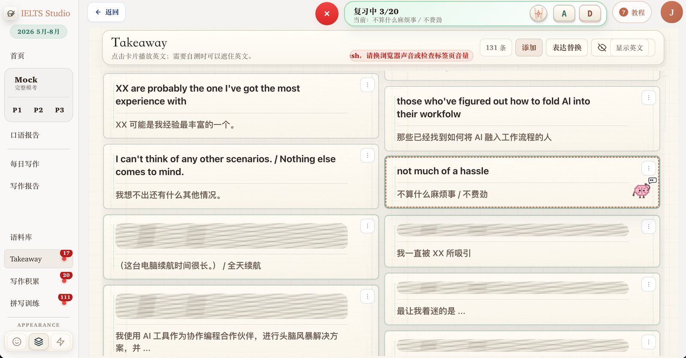

# IELTS Studio

AI-assisted practice for IELTS Speaking and Writing, plus a C++ real-time voice core for IELTS and job-interview simulation.
AI 辅助的雅思口语与写作练习平台，另含用于雅思与求职面试模拟的 C++ 实时语音核心。

> 🔗 **Live demo:** <https://ellen-windsor-wife-boats.trycloudflare.com>

## Screenshots · 界面截图

| Speaking practice: Part 3 discussion · 口语练习：Part 3 深入讨论 | Speaking report: overall review · 口语报告：总体点评 |
| --- | --- |
|  |  |

| Part 1 answer with AI feedback · Part 1 作答与 AI 反馈 | Part 3 feedback by argument move · Part 3 按论证方式点评 |
| --- | --- |
|  |  |

| Writing Task 2 with daily check-in · 写作 Task 2 与每日打卡 | Writing Task 1 paragraph feedback · 写作 Task 1 段落反馈 |
| --- | --- |
|  |  |

| Part 1 answer library · P1 短答语料库 | Part 2 story bank · P2 串题素材库 |
| --- | --- |
|  |  |

| Structured answer editor · 结构化答案编辑 | Takeaway review · Takeaway 表达复习 |
| --- | --- |
|  |  |

## Features · 功能

- **Speaking · 口语** — Part 1/2/3 and full mock tests: sampled questions, in-browser recording, transcription, AI follow-up questions, band-score reports and examiner audio.
  P1/P2/P3 与完整模考：题库抽题、浏览器录音、转写、AI 追问、带分数的报告和考官音频。
- **Writing · 写作** — daily writing, Academic Task 1 and Task 2 prompts, paragraph-level feedback with spelling and grammar corrections.
  每日写作、学术类 Task 1 与 Task 2 题库，段落级讲评与拼写、语法纠错。
- **Corpus & Takeaway · 语料与积累** — Part 1 answer library, Part 2 story bank, Part 3 materials, and a Takeaway book for reviewing saved phrasings.
  P1 语料库、P2 串题素材、P3 素材，以及复习收藏表达的 Takeaway。
- **Switchable AI providers · 可切换的 AI 服务** — any OpenAI-compatible HTTP endpoint, with a local fallback.
  支持任意 OpenAI 兼容接口，并有本地兜底。
- **C++ / WebAssembly audio · C++ 与 WASM 音频** — a C++ `audio_core` (WebRTC VAD via libfvad, silence trimming, resampling) compiled to WebAssembly for the browser; optional real-time ASR over WebSocket.
  C++ 编写的 `audio_core`（基于 libfvad 的 VAD、静音裁剪、重采样）编译为 WebAssembly 在浏览器运行；可选的 WebSocket 实时语音识别。

## How it works · 架构

```text
Browser single-page app (web/static)        浏览器单页前端
        │  REST /api/*, optional WebSocket PCM
        ▼
Django backend (backend_django)             Django 后端
  speaking · writing · corpus · AI task queue + worker
        │
        ├─> OpenAI-compatible HTTP provider (AI_HTTP_*)
        ├─> local fallback
        └─> VolcEngine TTS / ASR (optional)

C++ side (include/, src/)                   C++ 部分
  interview / IELTS command-line simulator, real-time client, audio_core → WebAssembly
```

## Quick start · 快速开始

```bash
python3 -m venv .venv-django && . .venv-django/bin/activate
pip install -r requirements/local.txt
cp .env.example .env                  # fill in your own keys · 填入你自己的密钥
python backend_django/manage.py migrate
scripts/start-local-stack.sh          # starts Django and the AI worker · 同时启动 Django 与 AI worker
```

Open <http://127.0.0.1:8767>. Writing scores need the AI worker; without it, reports stay queued.
打开 <http://127.0.0.1:8767>。写作评分需要 AI worker 在运行，否则报告会一直停在排队状态。

## Configuration · 配置

| Variable · 变量 | Purpose · 用途 |
| --- | --- |
| `AI_HTTP_BASE_URL`, `AI_HTTP_API_KEY`, `AI_HTTP_MODEL` | OpenAI-compatible endpoint · OpenAI 兼容接口 |
| `DJANGO_SECRET_KEY`, `DJANGO_ALLOWED_HOSTS`, `DJANGO_CSRF_TRUSTED_ORIGINS` | Django settings · Django 基本配置 |
| `VOLCENGINE_ASR_*` (optional · 可选) | Real-time speech recognition · 实时语音识别 |

Keys are read from environment variables only; never commit them. See `.env.example` for the full list.
密钥只从环境变量读取，不要提交进仓库。完整列表见 `.env.example`。

## C++ build · C++ 构建

```bash
cmake -S . -B build
cmake --build build --target IELTSSpeakingSimulator -j
cmake --build build --target audio_core_test -j
ctest --test-dir build -R audio_core_test --output-on-failure
scripts/build_audio_core_wasm.sh      # needs Emscripten · 需要 Emscripten
```

## Repository layout · 目录

```text
backend_django/   Django backend · Django 后端
web/static/       single-page frontend, no build step · 单页前端，无需构建
include/, src/    C++ simulator, real-time client, audio_core · C++ 代码
third_party/      libfvad (WebRTC VAD)
data/ielts/       question banks and prompts · 题库与提示词
scripts/          start, build and validation scripts · 启动、构建与验证脚本
docs/             design notes and README images · 设计文档与 README 配图
软件构造/          course-project deliverables · 课程实验材料
```

## Notes · 说明

- When no AI provider is reachable, the app falls back to local responses so the demo stays usable; these are not real AI results.
  AI 服务不可用时，应用会回落到本地兜底以保证演示可用，这些结果不是真实的 AI 输出。
- Before making a deployment public, check `.runlogs/`, `media/`, `reports/` and the local database for personal data.
  公开部署前，请检查 `.runlogs/`、`media/`、`reports/` 和本地数据库中是否含有个人数据。
